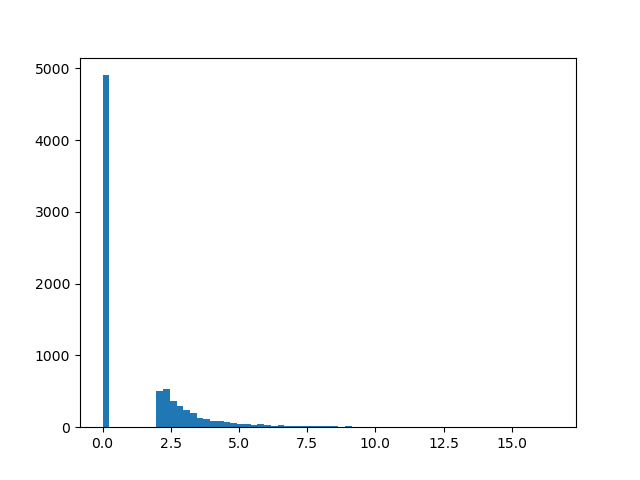

# Bayesian  DRM
bayesian inference DRM model

#### **TLDR**
 Based on the [Uber "Improve User Retention with Causal Learning"][1] we estimate a _"Direct Ranking Model" DRM_  for a promotion problem using a bayesian inference model the heterogeneous treatment effects. We build a simulated dataset and write a simple routine to find the original parameters and create an inferred ranking. 

This model was created with the excuse of applying some contents from the book ["Bayesian Methods for Hackers"][2] and the course ["Statistical Thinking"][3] this is not a real problem, and it was build just with the purpose of learning, however, it's a very common problem in the marketing industry. 

## Problem Statement 
In  Uber's [publication][1] they propose an optimization problem about maximize the total return $Y$ (churn) of a promotion based on a heterogeneity model. For the purpose of illustrating we are going to use a different example but with a similar objective. 

The `Stardust` coffee shop is a massive coffee chain that has a loyalty program where each costumer has a card that they can use to buy in the store. The `Stardust` loyalty program has a benefit that if you have the `Stardust Wallet` you are eligible for exclusive promotions. These promotions are part of the Marketing budget and their main focus is to maximize the costumers' demand $Y_i$ which in our case will be represented by the amount of spend \$ in coffees that a costumer $i \in C$ will buy certain week. 

In order to measure the performance of their campaigns' week by week `Stardust` randomly select two groups of clients and gave a promotion to one of them (an A/B test). They estimate that the return from the campaign will be given by the ATE from the ["Potential Outcomes Model"][4] given that this is a controlled randomized experiment, therefore we hold the [independence assumption][5], we can estimate that the incremental demand of the promotion from: 

$$ATE = \mathbb{E}(\mathrm{Y}^{1}|\mathrm{D} = 1) - \mathbb{E}(\mathrm{Y}^{0}|\mathrm{D}=0) =  \mathbb{E}(\mathrm{Y}^{1}) - \mathbb{E}(\mathrm{Y}^{0})$$

if we divide this $ATE$ with the spend on the discounts we will get the campaign [ROI][6] with this $ROI(c)$ the `Stardust` coffee shop was already capable of improving and testing with different mechanics; different discounts or different conditions such as _"valid for X amount of beverages"_. although all this improvement with different campaigns, they where more interested in targeting their discounts to certain costumers that might lead to a better `ROI`, they where particularly concern about if they target their promotions better they might optimize the `ROI` of the campaign. 

The main hypothesis that the `Stardust` shop has is that there is a _"costumer `ROI`"_ that can be estimated based on the historical discounts and after that they might target the costumers with the higher `ROI` and maximize then the campaign `ROI`, we probably don't know what is that number, but we might be able to infer it using *bayesian inference*

## The proposed model 

The problem from `Stardust` resembles a lot the problem exposed in the [paper][1], we will, therefore, use a very similar model. Let's assume that the costumer demand $Y_i$ will be given by the following formula:

$$Y_i(D) = \tau^{i}_{d}*D + \tau^{i}_{0}$$

Were basically we have the simplest way of describing the demand of the costumer $i$. $Y_i$ represents the demand in \$. $D$ is the discount given in \$ (we assume that we already normalized this amount type of discount/promo/etc to the final "burn"), and finally $\tau^{i}_{0}$ that is a variable that represents the "base demand" from the client $i$.   

We can estimate the client `ROI` using that formula simply applying:

$$ ROI_{i} = \frac{Y_{i}(D) - Y_{i}(0)}{D} = \frac{\tau^{i}_{d}*D + \tau^{i}_{0} - \tau^{i}_{d}*0 - \tau^{i}_{0}}{D} = \tau^{i}_{d} $$

So basically our `ROI_i` will be represented by `tau_i` ($\tau^{i}_{d}$). We also assume that each client "base demand" will be given by a distribution with parameters that are drawn by a population distribution. Therefore:

$$\tau^{i}_{0} \sim Gamma(\mu_i, \sigma)$$

where our $\mu_i$ will be drawn from a population normal:

$$\mu_i \sim N(\mu_p, \sigma_p)$$

and the parameters priors will be given by (example)

$$\sigma  \sim U[0,10]$$

$$\mu_p    \sim U[0,100]$$

$$\sigma_p \sim U[0,10]$$

The campaign `ROI` then will be given by:

$$ROI_c = \frac{\sum_{i \in (D_i=1)}{Y_i(D)} - \sum_{j \in D=0}{Y_j(0)}}{D} $$

Which is an observable variable (this is useful for the validation of the running experiment), but given that we assume full information from the payment method we will not need it as a fitting parameter.

## Simulation Results 

To simulate our data we use the following spend formula:

$$Y_{i}(D) = truncnormal(a, b, \mu_{i} = \tau^{i}_{d}*D_{i} + \tau^{i}_{0})* \mathbb{1}_{truncnormal(D)>trunc\_val} $$

where $a$ and $b$ are the lower and upper trunc limits for the `truncnormal` distribution (respectively). we define those limits as `a = 0`, `b = 30` which will meant that the weekely billings will be between `$0 USD` to `$30 USD`. Then we only keep the values where the spend is higher than a min threshold for the billing amount (this will provide us a 0 inflated interval). Finally the spend results are plotted in the following figure:

[1]: <http://proceedings.mlr.press/v104/du19a/du19a.pdf> "Improve User Retention with Causal Learning"
[2]: <https://github.com/CamDavidsonPilon/Probabilistic-Programming-and-Bayesian-Methods-for-Hackers> "Bayesian Methods for Hackers"
[3]: <https://github.com/dccuchile/CC6104#part-iii-bayesian-inference> "CC6104 Statistical Thinking"
[4]: <https://mixtape.scunning.com/04-potential_outcomes#average-treatment-effects> "Potential Outcomes Model"
[5]: <https://mixtape.scunning.com/04-potential_outcomes#independence-assumption> "Independence Assumption"
[6]: <https://en.wikipedia.org/wiki/Return_on_investment> "ROI"
