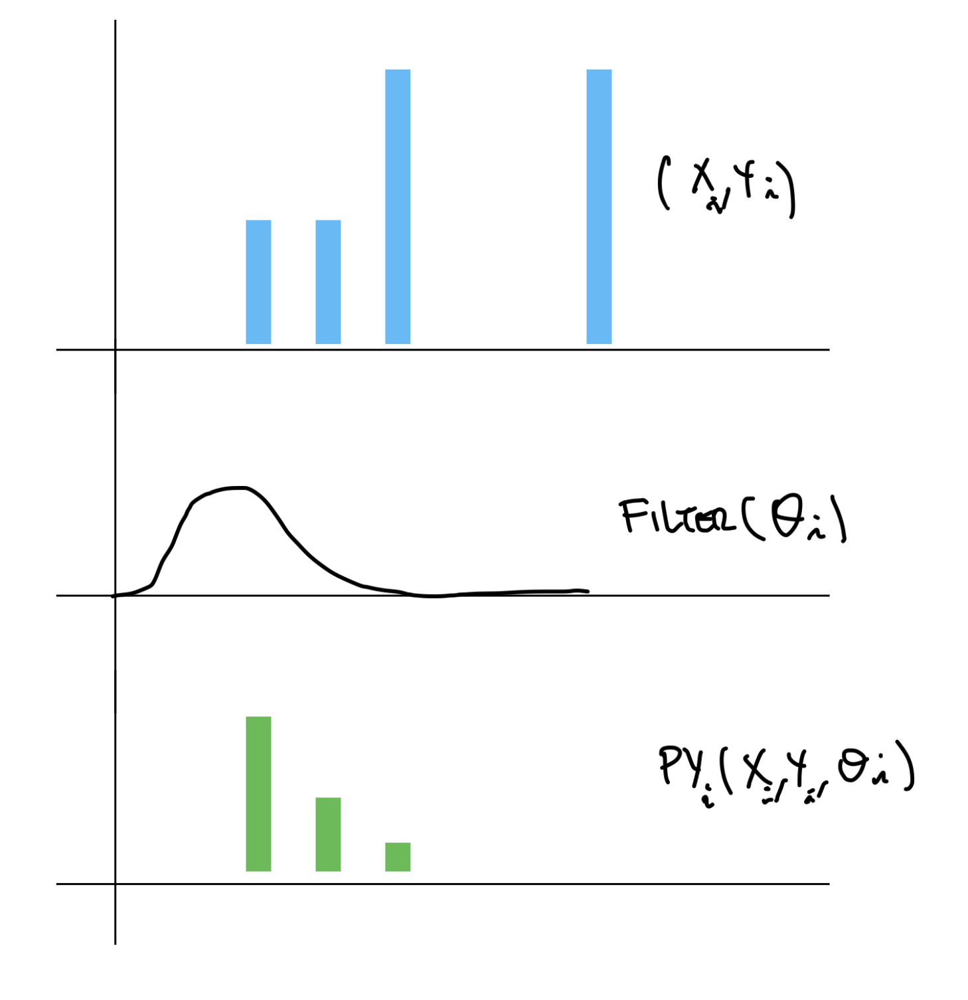

## Menu Model Problem

This is a variance of the promo problem where the mechanic `dxgy` is a number of alternatives like a menu of choices, for example:

- buy 10 you earn 1 
- buy 15 you earn 2
- buy 40 you earn 5

These menus can have multiples alternatives (potentially unlimited), the only constraint is that each alternative is unique per each "`dx`" and usually the earnings `gy` are [_monotonically non-decreasing_][1]. 

We need a model that can predict the number of purchases based on the promoted menu to each customer ( $T \in IR^{+}$ ). We have some data of past promotions (menus and one choice menus). 

Each new alternative has not to increase the probability to "qualify" on each one of the menu tiers, if it is not relevant for a costumer ([IIA][2]) with certain purchase behavior. For example if a customer usually buys 50 cups per month adding a 10 tier should not affect significantly their purchase behavior. Similarly, adding the menu choice of 100 should not affect that much the purchase behavior of the same customer, mainly because is twice as much as the costumer is used to buy. 

## NIA (no-IIA)

Using Bayesian inference modeling we propose a simplified version that tries to eliminate the IIA based on a "distribution filter". First we will model the purchase amount as a Poisson of parameter $\lambda_i , \forall i \in Clients$ 

$$
T_i \sim Poisson(\lambda_i)
$$

We assume that the $\lambda_i$ is a GLM that contains certain features of each client $i$ $\theta_i$ and some features of the "payments distribution" $feat(PY_i(X_i,Y_i, \theta_i))$ where $X_i$ and $Y_i$ are the menu options and their earnings vectors respectively. 

$$
\lambda_i \sim GLM(\theta_i, feat(PY_i(X_i,Y_i,\theta_i)))
$$

The $PY_i(X_i,Y_i,\theta_i)$ is a representation of the expected "relevant" payments for the client based on the menu ( $X_i,Y_i$ ) and the demographic/behavioral client features $\theta_i$. 

therefore

$$PY_i(X_i,Y_i,\theta_i) = Filter(\theta_i)*Y_i(X_i) $$

We can use multiple filter distributions $Norm(\mu(\theta_i),\sigma)$, $Triangular(a(\theta_i),b(\theta_i))$ (no-symmetrical), among others. 

The features in the $GLM(feat(PY_i))$ can be:

1. min, max, number of offers (?) 
2. Moments: mean, $\sigma$, $\sigma^2$, skewness, kurtosis 
3. Quantiles: P50,P80,P90
4. (discarted) Binned Histograms (defined for certain dx ranges this might be useful in a non-filtered model)
5. etc

Finally we fit all this parameters using MCMC. 

¿how we find the optimum promo-menu? 

$$ max_{X,Y} \sum_{i}{T_i(X_i,Y_i, \theta_i)} $$

st

$$ burn(X,Y|T_i) = \sum{Y_i} * \mathbb{P}(T_i \geq X_i \land T_i \le X_j )  \leq Budget $$

[1]:<https://en.wikipedia.org/wiki/Monotonic_function>
[2]:<https://en.wikipedia.org/wiki/Independence_of_irrelevant_alternatives>
